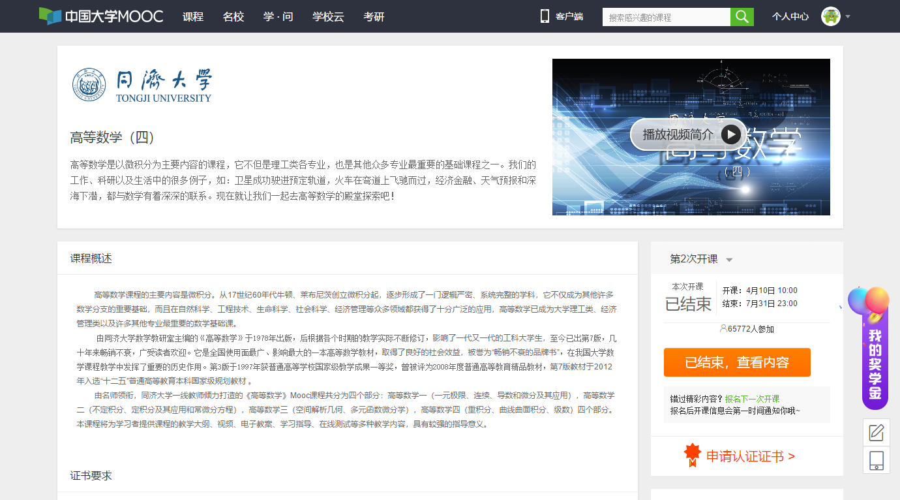
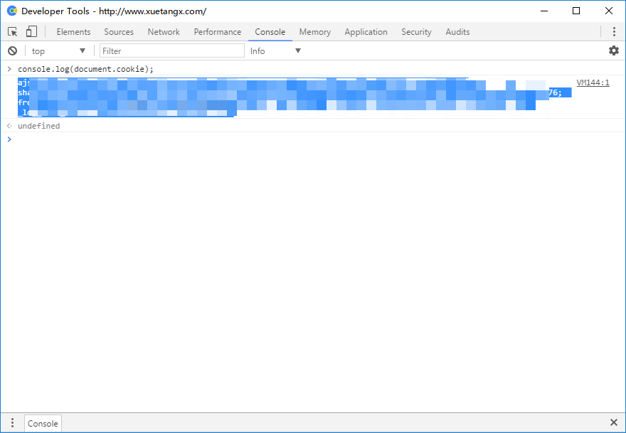
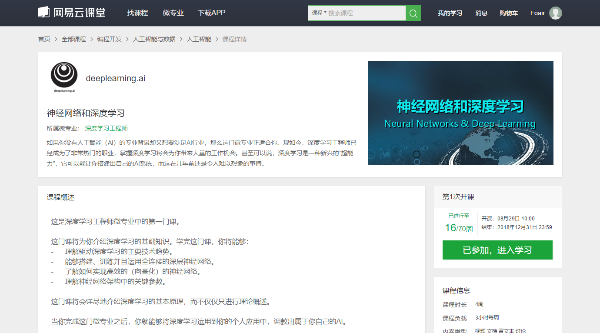
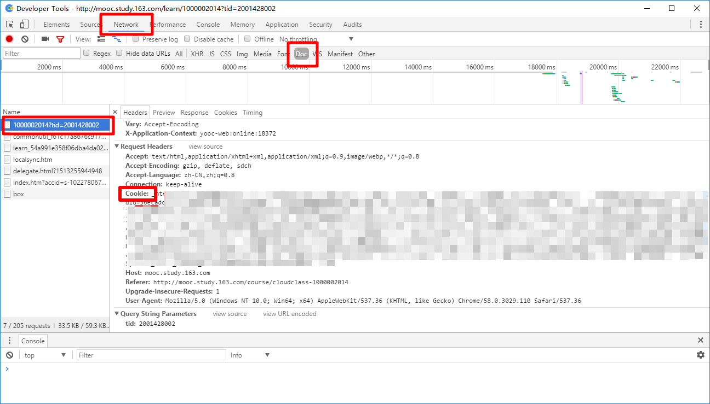

一个基于 Python 3 的 MOOC 课程爬虫，可以获取 [中国大学MOOC](http://www.icourse163.org/)、[学堂在线](http://www.xuetangx.com/)、[网易云课堂 MOOC](http://mooc.study.163.com/) 的免费课程，方便离线观看。中国大学MOOC和网易云课堂 MOOC 目前可以获取到的资源有视频、富文本、附件和字幕；学堂在线可以获取到视频和电子书。

虽然程序写的不怎么样，但是结构齐全、命名规范，可以很方便定位和查找。

## 说明

只在 Windows 10 经过简单测试，bug 和缺陷是肯定有的。

如果遇到有不能解析的课程，可以第一时间将课程的链接发到我的邮箱 [master@foair.com](mailto:master@foair.com)，我会尽快修复，但**请勿催更**。我会在时间充裕，并且我也需要下载新课程的时候才会更新。所以在程序还未失效的时候，**尽可能多**地下载视频。

放到 GitHub 是为了大家一起学习 Python，也勉励自己进步。如果有人愿意接手的话，那也是很好的哦。

如果有任何好的建议也可以通过邮件和我联系。

## 准备

请安装最新的 Python 3，并且使用 `pip` 安装 3 个库：`requests`，`BeautifulSoup4`，`lxml`：

```bash
pip install requests BeautifulSoup4 lxml
```

然后下载 ZIP 压缩文件（使用 Git 也是可以的），参照下面的各个文件的说明修改参数和保存路径。

- `mooc.py`：主程序

- `icourse.py`：中国大学MOOC模块
- `study.py`：网易云课堂 MOOC 模块
- `xuetangx.py`：学堂在线模块

下面是各个 MOOC 平台的说明，找到自己需要的看即可。

- [中国大学MOOC](#中国大学mooc)

- [学堂在线](#学堂在线)
- [网易云课堂 MOOC](#网易云课堂-mooc)

其他常见问题参见 [FAQ](#faq)

## 中国大学MOOC

课程的地址必须是这个样子：

`http://www.icourse163.org/course/TONGJI-1001569002`

或者这个样子：

`http://www.icourse163.org/course/TONGJI-1001569002?tid=1001640020`

这两个的区别就是开课的次数不同。第一个是第 2 次开课，第二个是第 1 次开课。

如果有遇到课程没有更新完，可以切换到上一次开课，这样就可以获取到全部的视频了。



当找不到这个页面的时候，可以通过点击课程的名字来到这个页面哦！


## 学堂在线

课程的地址必须是这个样子的：

`http://www.xuetangx.com/courses/course-v1:TsinghuaX+00740043_2x_2015_T2+sp/about`

最后有一个 `about`，必须是这样的地址。


学堂在线必须使用 cookies 登录，可以在浏览器控制台中执行如下内容：

```javascript
console.log(document.cookie);
```

然后复制输出的内容。



## 网易云课堂 MOOC

无法适用于网易云课堂的普通课程，只适用于 `mooc.study.163.com` 域下的课程，只能使用 cookie 登录。不像中国大学MOOC那样，网易云课堂 MOOC 必须要登录才有权限查看和下载课程，所以登录的 cookies 务必设置。

课程地址是这样的地址：

`http://mooc.study.163.com/course/2001281002#/info`



找不到如图页面的话，也可以参照中国大学MOOC的方法。

用浏览器进入网易云课堂的首页，然后登录。打开一个 MOOC 课程的页面，比如 [程序设计入门—Java语言 - 网易云课堂](http://mooc.study.163.com/course/cloudclass-1000002014)。右键 ➔ 【审查元素】，然后切换到【Network】选项卡，然后点进入课程的学习按钮。回到【Network】那里，选择【Doc】，点第一个。然后往下滚动，复制 `Cookie:` 后面的内容。



## 运行程序

在命令行窗口中输入 `python mooc.py <地址>` 即可下载课程到当前文件夹。

这里的地址是课程的地址，可以是三个的平台的任何一个，程序会自动识别。

学堂在线和网易云课堂需要经过认证，如果没有看过前面的内容的话，可能要回到前面看看。

`mooc.py` 可以有可选参数，`-h` 或 `--help` 显示帮助信息，`-d` 指定下载目录，比如：

```
python mooc.py http://www.icourse163.org/course/BIT-1001870001 -d "F:\Courses"
```

值得注意的是，`"F:\Courses"` 最后不能有 `\`。当这个目录名存在空格的时候，必须使用 `""`。

还有一个可选参数是 `--no-pdf`，当指定了这个参数之后，网易的网站不下载课件，学堂在线的网站不下载电子书。比如：

```
python mooc.py http://www.icourse163.org/course/BIT-1001870001 --no-pdf
```

如果不想每次都指定下载目录的话，可以修改 `mooc.py`，找到如下行：

```python
    parser.add_argument('-d', default=r'F:\MOOCs', help='下载目录')
```

将 `F:\MOOCs` 替换为自己的目录即可。

## 运行成功后

课程的目录可能有如下文件（夹）：

```
Files\
PDFs\
Texts\
Outline.txt
Rename.bat
Videos.txt
```

### 课程的目录、视频和视频重命名

☸ `Outline.txt` 是课程的目录，它可能长成这个样子：

```
6.1 空间直角坐标系及向量 {1}
  6.1.1 空间直角坐标系的基本概念 {1.1}
    6.1.1 空间直角坐标系的基本概念（视频） {1.1.1}
    6.1.1 空间直角坐标系的基本概念（PPT） {1.1.1}+
    6.1.1 空间直角坐标系的基本概念（PPT） 空间直角坐标系的基本概念.rar {1.1.1}!
...
```

每个级别依次增加 2 个空格的缩进，`{}` 之间的是程序生成的编号，用来唯一标识一个资源（比如视频、富文本等等）。`{1.1.1}` 表示该视频以 `1.1.1` 开头，如此可以方便地找到视频。有些后面可能有奇怪的符号比如 `{1.1.1}+`，`+` 代表它是一个富文本文档，可能需要到 `Texts` 目录去找到相应文件。

下面是符号的说明：

`{1.1.1}`：视频文件，位于课程根目录下
`{1.1.1}*`：课件，一般是 PDF 文件，位于 `PDFs` 目录下
`{1.1.1}+`：富文本，一般是 HTML 文件，位于 `Texts` 目录下
`{1.1.1}!`：附件，位于 `Files` 目录下

☸ `Videos.txt` 是视频的链接，它可能长成这个样子：

```
http://v.stu.126.net/mooc-video/nos/mp4/2017/02/21/1005820377_aa6e1b0d92314cdfaf6dcad3351b3533_shd.mp4?ak=99ed7479ee303d1b1361b0ee5a4abcee11069a7277fd2bfbd983de77f6586b3ab4d3781458cdbd61bf0041fae59dee85cb91769ba5850a28845217d0bc9bfb580015e48ffc49c659b128bfe612dda086d65894b8ef217f1626539e3c9eb40879c29b730d22bdcadb1b4f67996129275fa4c38c6336120510aea1ae1790819de86e0fa3e09eeabea1b068b3d9b9b6597acf0c219eb000a69c12ce9d568813365b3e099fcdb77c69ca7cd6141d92c122af
http://v.stu.126.net/mooc-video/nos/mp4/2017/02/21/1005822368_a91783c5f05a49e29960d24f1dc06f15_shd.mp4?ak=99ed7479ee303d1b1361b0ee5a4abcee11069a7277fd2bfbd983de77f6586b3a33090c48273cc5e338f1d269a2b016013857294759d07b499e26c45d788128b30015e48ffc49c659b128bfe612dda086d65894b8ef217f1626539e3c9eb40879c29b730d22bdcadb1b4f67996129275fa4c38c6336120510aea1ae1790819de86e0fa3e09eeabea1b068b3d9b9b6597acf0c219eb000a69c12ce9d568813365b3e099fcdb77c69ca7cd6141d92c122af
...
```

可以把视频的链接用各种下载工具下载，比如 [aria2](https://github.com/aria2/aria2/releases)、[迅雷](http://dl.xunlei.com/) 等，也可以直接在浏览器中打开。

☸ `Rename.bat` 可以把视频重命名，它可能长成这个样子：

```
CHCP 65001

REN "1005820377_aa6e1b0d92314cdfaf6dcad3351b3533_shd.mp4" "1.1.1 空间直角坐标系的基本概念(视频）.mp4"
REN "1005822368_a91783c5f05a49e29960d24f1dc06f15_shd.mp4" "1.2.1 向量的坐标表示(视频）.mp4"
REN "1005817378_500b5301360f49c18c6f8d3406959cf5_shd.mp4" "1.3.1 向量的模、方向余弦、投影（视频）.mp4"
REN "1005821395_ff485bb1e65145ec90bf04a259eb6b0e_shd.mp4" "2.1.1 向量的数量积(视频）.mp4"
REN "1005821396_9180e5908bc847548a8db625af9b1ad7_shd.mp4" "2.2.1 向量的数量积（续）（视频）.mp4"
REN "1005817386_18d7ede415ec4cb5befa71a9d790ce0f_shd.mp4" "2.3.1 向量的向量积（视频）.mp4"
REN "1005822373_8bf3846066e045cda306bd7d27e38786_shd.mp4" "2.4.1 向量的向量积（续）（视频）.mp4"
REN "1005899086_7780acc4ac074ed89b6301e41349a2c1_shd.mp4" "3.1.1 平面方程（视频）.mp4"
...
```

下载下来的视频文件名是一团糟的，当视频和这个文件在同一个目录的时候，就可以双击该文件，然后视频的文件名就很清晰整齐了。

### 几个文件夹

对于中国大学MOOC和网易云课堂 MOOC 课程

`Files` 是课程的附件；`PDFs` 是课程的课件；`Texts` 是课程的富文本。

学堂在线

`Books` 是课程提供的电子书。

## FAQ

☸ 我的 cookies 输错了（失效了），怎么重新填写 cookies？

> Cookies 是保存在文件里的，对于学堂在线是 `cookies_xuetangx.json`，网易云课堂是 `cookies_mooc_study.json`，只要删除对应的文件就会要求重新输入 cookies 了。
